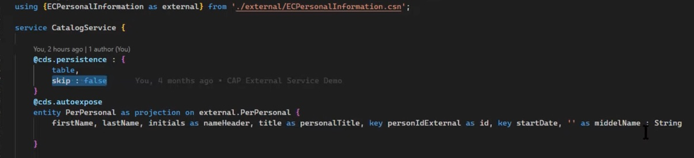
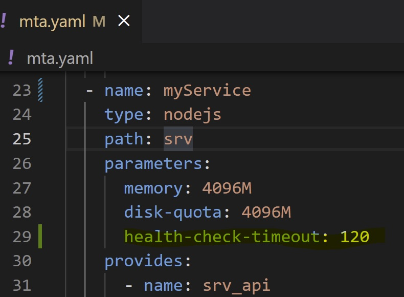

# cap-real-world
My findings from using CAP and Fiori Elements in real-world projects. Issues, workarounds and tips.

## Abbreviations used
| Abbreviation | Description |
| ------------ | ----------- |
| CAP          | Cloud Application Programming model |
| FE           | Fiori Elements |
| MTA          | Multi-target Archive |


# Contents
* [MTA's](#mta)
    - [DefaultEnv CF CLI Plugin](#default-env-plugin)
    - [HDI Deployer - auto-undeploy property](#hdi-deployer-auto-undeploy)
* [CAP](#cap)
    - [Scaffold a new CAP app](#scaffold-a-new-cap-app)
    - [Some notes on the CAP generator](#some-notes-on-the-cap-generator)
    - [Architecting CAP based UI5 apps for the Launchpad service (multiple apps/resuse)](#architecting-cap-based-ui5-apps-for-the-launchpad-service)
    - [Separating fiori apps from the CAP service with separate MTA's](#separating-fiori-apps-from-the-cap-service-with-separate-mtas)
    - [How to setup the cds.requires section of package.json](#how-to-setup-the-cds-requires-section-of-package-json)
    - [How to work with HANA specific artefacts](#how-to-work-with-hana-specific-artefacts)
    - [Service Handlers](#service-handlers)
    - [Long running CAP service handlers](#long-running-cap-service-handlers)
    - [Efficient (dare I say best practice) annotation file structure](#efficient-dare-i-say-best-practice-annotation-file-structure)
    - [CodeLists](#codelists)
    - [Security - where to put role collections](#security-where-to-put-role-collections)
    - [Security - how to secure endpoints](#security-how-to-secure-endpoints)
    - [Logging and Debugging](#logging-and-debugging)
    - [Debugging with Chrome](#debugging-with-chrome)
    - [Kibana friendly log output](#kibana-friendly-logs)
    - [Custom error messages for mandatory fields](#custom-error-messages-for-mandatory-fields)
    - [Working with lots of data in CAP](#working-with-lots-of-data-in-cap)
    - [Monitoring memory, cpu, event loop ](#monitoring-memory-cpu-event-loop)
    - [Remote services with persistence](#remote-services-with-persistence)
    - [Value Helps CDS entities must have keys](#value-help-cds-entities-must-have-keys)
    - [CAP deployment error - timeout health check](#cap-deployment-error-timeout-health-check)
* [Fiori Elements](#fiori-elements)
    - [Value Helps](#value-helps)
    - [General](#fe-general)
    - [Managed Approuter specifics](#managed-approuter)
* [Fiori](#fiori)
    - [Standalone fiori app](#standalone-fiori-app)
    - [Create a Fiori app for deployment to BTP cloud foundry](#create-a-fiori-app-for-deployment-to-btp-cloud-foundry)
* [Node.js/NPM](#node-npm)
* [HANA CLOUD](#hana-cloud)
    - [Cross HDI Container Access With CAP Localized Entities](cross-hdi-container-access-with-cap-localized-entities)
---

&nbsp;  
&nbsp;  

# MTA

### default-env plugin
__*NOTE: this should be considered deprecated and `cds bind` can be used instead.*__

The CF CLI default-env plugin is a great help in automatically creating your default-env.json file, which provides environment variables so that you can run services locally when developing.

Usage:
```
cf default-env myapp-srv
```
Where `myapp-srv` is the service instance on cloud foundry you want to pull down env vars from. So in this example I'm getting the env vars for a CAP service called myapp-srv.

NOTE: When you deploy an MTA, destinations seem to be overwritten and so when you try and execute your app locally again it won't find the destination on cloud foundry - requiring you to run `cf default-env myapp-srv` again...

```
resources:

#---------------------------------------------
# Destination to remote service
#---------------------------------------------
- name: remote-api-destination
  type: org.cloudfoundry.managed-service
  parameters:
    config:
      HTML5Runtime_enabled: true
      init_data:
        instance:
          destinations:
          - Authentication: NoAuthentication
            Name: remote-dest
            ProxyType: Internet
            Type: HTTP
            URL: https://blahblahblah/api/v1/search
          existing_destinations_policy: update
      version: 1.0.0
    service: destination
    service-plan: lite
```
Note the `existing_destinations_policy: update` value.
You could try changing this setting from `update` to `ignore` and indeed this stops the destination from being changed on each deployment. BUT - it seems the *bindings* are re-created every time anyway.
So, there does not seem to be a way to get around this (having to continually run default-enc) right now.

### hdi-deployer auto-undeploy
To set auto-undeploy for the hdi deployer module set the following `property` in the hdi deployer module (in your MTA):
```
  # ---------------- DATABASE DEPLOYER MODULE ------------------
  - name: activityrepo-db-deployer
  # ------------------------------------------------------------
    type: hdb
    path: gen/db
    parameters:
      buildpack: nodejs_buildpack
      memory: 256M
      disk-quota: 1024M
    properties:
      HDI_DEPLOY_OPTIONS: "{ \"auto_undeploy\": true, \"trace\": true }"
    requires:
      - name: activityrepo-uaa
      - name: activityrepo-db
```
*Alternativly use an undeploy.json file which is created automatically if you start your project with `cds init`.*

# CAP
## Scaffold a new CAP app
For a step-by-step procedure this is a great developer tutorial showing how to start a CAP project: [Build an application end-to-end using CAP, Node.js and VS Code](https://developers.sap.com/mission.btp-application-cap-e2e.html).

There are a lot of steps in this tutorial and its mostly boilerplate. We can use the [SAP HANA Academy CAP generator](https://github.com/saphanaacademy/generator-saphanaacademy-cap) to automatically create all this.

The SHA CAP generator is well explained in this [series of videos](https://www.youtube.com/playlist?list=PLkzo92owKnVwQ-0oT78691fqvHrYXd5oN) by the SHA team.

*__Update Auguest 2022__: A great starting point for a CAP project is the [Business Application Studio (BAS) low-code tooling](https://developers.sap.com/group.appstudio-low-code-app.html). Here we can very easily scaffold out a new project with all the correct deployment settings and carry on development locally if you wish.*

### Some notes on the CAP generator
- Ideally you would use the HTML5 repository to host your web app. There is an option to put your web app inside the approuter, but its really only for small apps or test apps. If you choose the HTML5repo option then the generated sample fiori app will be correctly setup with UI5-tooling and the normal build process.
- This blog post: [How to share tables across different cap projects](https://blogs.sap.com/2021/10/03/how-to-share-tables-across-different-cap-projects/) is fantastic and each of these options is catered for by the CAP generator.
- This developer tutorial [Combine CAP with SAP HANA Cloud to Create Full-Stack Applications](https://developers.sap.com/mission.hana-cloud-cap.html) shows how to access native SAP HANA Cloud artefacts in a CAP project.
__Recommendation__:The CAP generator also does this for you.

## Architecting CAP based UI5 apps for the Launchpad service
When building CAP projects and adding UI's you have some architecture options such as the following (could be more):
- Create a UI app completely separately (in another MTA) from the CAP service MTA
- Create a UI app inside the same MTA as your CAP project
- Create multiple UI apps inside the same MTA as your CAP project or even use a UI reuse component
- Split the UI apps into separate MTAs.

A great series of blog posts showing the different ways to architect your ui5 apps for BTP:
1. [A simple UI5 app that runs in the launchpad serivce](https://blogs.sap.com/2022/01/14/designing-ui5-apps-for-sap-launchpad-service-part-1/)
1. [Multiple apps with a shared reuse library](https://blogs.sap.com/2022/02/08/designing-ui5-apps-for-sap-launchpad-service-part-2/)
1. [Splitting bigger projects](https://blogs.sap.com/2022/02/17/designing-ui5-apps-for-sap-launchpad-service-part-3/)

## Separating fiori apps from the CAP service with separate MTAs
It is not always the case that you will want your UI app(s) to be part of the same MTA as the CAP service.
&nbsp;
Cases where you want to create a reusable API with CAP for example.

For these cases - we can use cross-mta references. See these blog posts for details:
- [Split MTA into backend & frontend – Managed AppRouter](https://blogs.sap.com/2021/03/03/split-mta-into-backend-frontend-managed-approuter/)
- [Split MTA into backend & frontend – Standalone AppRouter](https://blogs.sap.com/2021/03/10/split-mta-into-backend-frontend-standalone-approuter/)


## How to setup the cds requires section of package json
See this example below. By using `profiles` we can run locally with mock users or a different database (sqlite db file) in "development mode". Then in "production mode" use the HANA Cloud db for example.

You can run the relevant profile like:
```
npx -p @sap/cds-dk cds build --production
```

The above is the CAP build step inside an mta.yaml file (as an example).

`cds watch` uses the `[development]` profile by default.

```
  "cds": {
    "requires": {
      "uaa": {
        "kind": "xsuaa"
      },
      "auth": {
        "[production]": {
          "strategy": "JWT"
        },
        "[development]": {
          "strategy": "mock",
          "users": {
            "joe": {
            },
            "julie": {
            },
            "bob": {
            }
          }
        }
      }
      ,
      "db": {
        "[production]": {
          "kind": "hana"
        },
        "[development]": {
          "kind": "sql"
        },
        "model": [
          "db",
          "srv"
        ]
      }
      }
    ,
    "hana": {
      "deploy-format": "hdbtable"
    }
  }

```

## How to work with HANA specific artefacts
If you add hana specific artefacts to your project - for example - using the annoation `@cds.persistence.exists;` then you will find it wont work with `cds watch` anymore.

What we can do is have these hana specific artefacts listed in a separate cds file that is only included with the `[production]` profile.

e.g.
Lets say we want to use an existing hana view. We can create a separate cds file at `db/hana/index.cds` and refer to it in our cds config like this (package.json):
```
  "cds": {
    "requires": {
      ...
      "db-ext": {
        "[production]": { "model": "db/hana" }
      }
```

Then in the new file we can add content like:
```
/**
 * Add hana db specifics
 * 
 * Controller by "db-ext" cds config.
 */
using { activityrepo.db.Product, activityrepo.db.ProductCategory } from '../data-model';

annotate activityrepo.db.Product with @cds.persistence.exists;
annotate activityrepo.db.ProductCategory with @cds.persistence.exists;
```

Now we can test locally with `cds watch` and still deploy to cloud foundry (production) and use the real hana artefacts.

## Service Handlers
`each` has a special meaning in handler parameter names.
By naming the event or parameter in a handler `each` it will be called as a per-row handler - as a convenience shortcut.

*Is this still the case? Seems to have changed and you now get an array of objects on the list page and then just the one object on the object page.*

```
this.after('each','Books', (book)=>{
  book.stock > 111 && book.discount='11%'
})
```

```
this.after('READ','Books', (each)=>{
  each.stock > 111 && each.discount='11%'
})
```

[Details](https://cap.cloud.sap/docs/node.js/services#event-handlers)


## Long running CAP service handlers
By default a CAP service destination will have a 30 second timeout. If you have a long running process then we can use the `HTML5.Timeout: 300000` (e.g. 5mins) parameter on the destination.
The destination needs to be the CAP service destination (the one which provides *srv-api*).

## Efficient (dare I say best practice) annotation file structure
I've always had an uneasy feeling with the metadata driven development model for fiori elements. We've always been taught about separation of concerns in software industry for decades now and here we are mixing up UI code with the persistence layer.

So what I try to do is still keep some separation. Where it makes sense I will add annotations to the data model but only annotations that matter at that level - things such as typecasts; units of measure and curreny annotations for example.

For all UI annotation I try best to keep them separated.

SAP provides a wonderful example repository for FE and CAP based on the Fligths data mode here: https://github.com/SAP-samples/cap-sflight.

In this sample app you can see that all the UI annotations are placed inside the `app` folder, which makes perfect sense to me.

But going forther, the annotation fles are split up into domains such that we have:
- `layouts.cds`
- `labels.cds`
- `value-helps.cds`

...and so on.

I find this separation awesome and its very quick to know where the annotations live for particular features. This becomes more and more important the bigger your app becomes. Lets face it - even an app with just two object pages can have a huge amount of UI annotations.

Here's a view of the directory structure:


__*UPDATE: August 2022 - I'm now leaning toward just having one annotations file (as generated by default by fiori-tools for example) and then using fiori-tools as much as possible so that we no longer have to code any annotations. Fiori-tools gets confused when you have many different annotations files.*__

## CodeLists
Make sure to only have one key field in a code list, otherwise FE won't be able to display the values properly. See examples here, particularly the last one which shows how to add additional fields (non key):
```
entity ActivityStatus : CodeList {
    key code : Integer enum {
            Planned    = 0;
            InProgress = 1;
            Cancelled  = 2;
            Complete   = 3;
        } default 0;
};

entity ActivityType : CodeList {
    key code : Integer enum {
            Renewal     = 0;
            Replacement = 1;
            Upsell      = 2;
            Go_live     = 3;
        };
    category : Integer;
}
```

__Note: If a field with a codelist attached is going to be used as an additional binding on a value help then there seems to be a bug that it cannot have 0's. So make your codelist 1-based if its and Integer key.__

## Security where to put role collections
Where is the best place to place your apps role collections and security info?

There are 3 ways to create role collections for your app:
1. In the xs-security.json file
1. In the mta.yaml file
1. Create them manually in the BTP cockpit.

### xs-security.json
Role Collections can be specified inside the [xs-security.json](https://help.sap.com/docs/BTP/65de2977205c403bbc107264b8eccf4b/517895a9612241259d6941dbf9ad81cb.html) file. 

By specifying them here you keep all your security in the one place and not mixed up between here and the mta.yaml.

Considering that *best practice* is to use separate subaccounts for each application layer (dev, tst, prd, etc) then there is no need to really append the space name to the role collections as allowed by using the mta.yaml.

## Security how to secure endpoints
See the [Node.js best practices](https://cap.cloud.sap/docs/node.js/best-practices) section in the CAP doco for general advice on securing endpoints.
In general it includes:
- Content Security Policy (CSP)
- Cross-Site Request Forgery (CSRF)
- Cross-Origin Resource Sharing (CORS)

Some of these are already handled if your frontend apps are Fiori-based.

### mta.yaml
In the UAA resource in the mta.yaml you can define your Role Collections like this example:
```
resources:
  # ----------------------- UAA SERVICE ------------------------
  - name: activityrepo-uaa
  # ------------------------------------------------------------
    type: org.cloudfoundry.managed-service
    parameters:
      service: xsuaa
      service-plan: application
      path: ./xs-security.json
      config:
        role-collections:
        - description: Administer Activity Repo
          name: FREActivityAdmin-${space}
          role-template-references:
          - $XSAPPNAME.FREActivityAdmin
```
You can see that you can automatically append the space name when defining your role collections here.

### Manual
You can manually create Role Collections in the BTP cockpit. They can be created with the required scopes pre-filled if your xs-security.json already includes the Role Templates.

### My thoughts
I prefer to place the role collections for my apps in the xs-security.json file instead of in the mta.yaml, even though you can use either. More complexity is allowed for in the xs-security.json file incuding *attribute* security.
Also - the best practice is to separate your development layers by sub-account and not space (dev, test, prod). This is the only way to truly keep things separated as a lot of BTP services don't have the concept of a cloud foudry space.

## Logging and Debugging
You may want to log debug information, but only when you are actually having issues - so not generally clogging up the logs.

A standard node.js way to do this is with the `debug` module.

Add it to the package.json as a dependency like so:
```
"dependencies": {
    "@sap/cds": "^4",
    "debug": "^4.3"
}
```

Now in the CAP service where you may like to issue debug logs (at the top of the file):
```
const debug = require('debug')('srv:catalog-service');

module.exports = ...
```

`srv:catalog-service` is any name you like and will be used to reference this module for when you want it to issue debug statements to the log (see further below).

Now, instead of doing calls to `console.log()` you can do calls to `debug()`.

e.g.
```
debug(ech.comments, {"country": each.country, "amount": each.amount});
```

When we run our app we need to set the `DEBUG` environment variable like so:
```
DEBUG=srv:* cds watch
```
This will set debug locally for this `cds watch` and it will do so only for modules matching this label `srv:*`. Remember that we imported the debug module with a name: `srv:catalog-service`.

When your app is deployed on cloud foundry we need to inject the debug environment into the service.

We can view cloud foundry app logs:
```
cf logs app-srv
```

Inject the environment variable
```
cf set-env app-srv DEBUG 'srv:*'
```
Restage the service for the environment variable to take affect
```
cf restage app-srv
```

[HANA Academy - Extension Generators - debug](https://www.youtube.com/watch?v=XA6S2zVpTSQ&list=PLkzo92owKnVwQ-0oT78691fqvHrYXd5oN&index=6)

Here's another example of injecting and environment variable into the cloud foundry environment:
```
cf se activityrepo-srv DEBUG 'xssec:*'
```
In this case we are asking for more debug info in the cap service logs for the xssec (security) component. Good for finding xsuaa issues.
`cf se` is shorthand for `cf set-env`.

For extra denug logs on remote calls:
```
cf se activityrepo-srv DEBUG 'remote'
```

See full list of remote logging module name in the [CAP help](https://pages.github.tools.sap/cap/docs/node.js/cds-log#cds-log-modules).


## Debugging with Chrome
You can debug your CAP service directly in the Chrome debugger. Which means you can use the chrome debugger for both the CAP service and any web app your project may have.

When running `cds watch` you can simply type `debug` ENTER. This will restart in debug mode.

Now navigate to [chrome://inspect](chrome://inspect) and choose the "Open dedicated DevTools for Node" link.

You know have a full debugger - can set break-points - single step - and so on...

This is a great way of debugging if you are not using BAS or VSCODE which have built-in debuggers.

__*UPDATE August 2022: I now prefer to deug from vscode. You just need a run configuration to launch your app and then can use the vscode debug facilities. Its a little nicer and quicker to use than opening up the chrome debugger each time.*__

## Kibana friendly logs
Configure the Kibana formatter in the package.json:


Use the kibana formatter like so:
```
const LOG = cds.log('custom')
LOG.info("My custom log output")
```

## Custom Error Messages for mandatory fields
[How to specify custom error messages for mandatory fields](https://answers.sap.com/questions/13422645/custom-error-messages-for-mandatory-fields.html)

## Working with lots of data in CAP
When performing updates in a CAP service, CAP executes [integrity checks](https://cap.cloud.sap/docs/guides/providing-services#refs) on associations.

These integrity checks can *massively* slow down performance. With large amounts of updates it can also lead to memory leaks and an exploding node.js heap.

There are a couple of things that you can do:
1. Completely disable integrity checking in your CAP app
1. Disable integrity checking when you are about to perform a *heavy* operation and then turn it back on afterward

Integrity checking can be globally disabled in the package.json (and numerous other locations):
```
...
    "cds": {
        "requires": {
            "db": {
                "kind": "sql",
                "pool": {
                    "acquireTimeoutMillis": 10000,
                    "max": 1000
                }
            },
            "uaa": {
                "kind": "xsuaa",
                "credentials": {}
            },
        },
        "hana": {
            "deploy-format": "hdbtable"
        },
        "features": {
            "assert_integrity": false
        }
    }
```

Integrity checks can be disabled programmatically by setting `cds.env.features.assert_integrity = true` to true/false.

*!! Since the time of writing CAP now performs integrity checks on the db level so performance may be far better.*

## Monitoring memory cpu event loop 
[Clinic Doctor](https://clinicjs.org) is a great toolset for monitoring the performance of Node.js applications.

Run clinic doctor (from within your project) with CAP as follows:
```
clinic doctor -- node ./node_modules/.bin/cds run --in-memory
```
At the end of your test use ctrl-c to exit and a web browser window will automatically open with the performance test results.

Occasionally clinic doctor can fail to build the html page. If this happens then run the following to manually produce it:
```
clinic doctor --visualize-only .clinic/37637.clinic-doctor
```
Where the directory: `.clinic/37637.clinic-doctor` is where the captured trace files were written.

NOTE: When running clini doctor for a long time, the data collection can get into the GB's and processing the charts in the web page can take 5 to 10 minutes plus.

## Remote services with persistence
Sometimes you may have an external service and you extend that service in CAP with additional fields. In this case you need to persiste the data. See here the annotations to allow this:


Note that we still need to tell CAP how to combine our remote service with the locally persisted properties and this is done in our service handler.
In this (`.on`) handler we can make the external call to our external service and then expand on the result with our own data.

A good deep dive from Thomas Jung on using remote services in CAP: [Consume external services](https://www.youtube.com/watch?v=rWQFbXFEr1M).

## Value Helps CDS entities must have keys
As of SAPUI5 1.104.\* Fiori Elements value helps all require their backend entities to have a key(s) field defined.

## CAP deployment error - timeout health check
On deployment to cloud foundry a health check is executed after 60 second (by defauilt). If you have a long running startup on your app this can fail with an error like:
```
YYYY-MM-DDTHH:MM:SS.00-0X00 [HEALTH/0] ERR Failed to make TCP connection to port 8080: connection refused
YYYY-MM-DDTHH:MM:SS.00-0X00 [CELL/0] ERR Timed out after 1m0s: health check never passed.
YYYY-MM-DDTHH:MM:SS.00-0X00 [APP/PROC/WEB/0] OUT Exit status 143
YYYY-MM-DDTHH:MM:SS.00-0X00 [CELL/0] OUT Cell XXXXXXXX stopping instance XXXXXXXX
YYYY-MM-DDTHH:MM:SS.00-0X00 [CELL/0] OUT Cell XXXXXXXX destroying container for instance XXXXXXXX
YYYY-MM-DDTHH:MM:SS.00-0X00 [API/1] OUT Process has crashed with type: "web"
YYYY-MM-DDTHH:MM:SS.00-0X00 [API/1] OUT App instance exited with guid XXXXXXXX payload: {"instance"=>"XXXXXXXX", "index"=>0, "cell_id"=>"XXXXXXXX", "reason"=>"CRASHED", "exit_description"=>"Instance never healthy after 1m0s: Failed to make TCP connection to port 8080: connection refused", "crash_count"=>1, "crash_timestamp"=>XXXXXXXX, "version"=>"XXXXXXXX"}
```
See https://launchpad.support.sap.com/#/notes/0002833450.

[Cloud foundry doco on health checks](https://docs.cloudfoundry.org/devguide/deploy-apps/healthchecks.html#setting_health_checks)
[MTA descriptor doco showing MTA parameters that can be used](https://help.sap.com/docs/SAP_HANA_PLATFORM/4505d0bdaf4948449b7f7379d24d0f0d/4050fee4c469498ebc31b10f2ae15ff2.html?version=2.0.03&advPhr=health-check)



# Fiori Elements
Excellent resource for Fiori Elements V4 - sample app showing lots of features:
[FE V4 features sample app](https://github.com/SAP-samples/fiori-elements-feature-showcase)

## Value Helps
When creating value helps with dependent values on other fields I have noticed that they do not work when the dependent value is a `0`.

For example - this value help on ActivityType is dependent (or should be filtered) on the category, which is a separate field on the page:
```
annotate CustomersService.Activities with {
    activity_type @Common.ValueList: {
        CollectionPath : 'ActivityType',
        Label : 'Activity Type',
        Parameters : [
            {$Type: 'Common.ValueListParameterInOut', LocalDataProperty: activity_category_code, ValueListProperty: 'category'},
            {$Type: 'Common.ValueListParameterInOut', LocalDataProperty: activity_type_code, ValueListProperty: 'code'},
            {$Type: 'Common.ValueListParameterDisplayOnly', ValueListProperty: 'name'}
        ]
    };
}
```
If the category_code values can be 0, 1, 2, 3, 4 for example and 0 is chosen by the user, the filtering will not work!

__So your dependent values MUST NOT BE 0-based if they are Integers.__

## FE General
Please always lock your app to a specific version of SAPUI5. I have found that FE is notorious for breaking when new patch levels are released.

## Managed Approuter
When using the managed approuter be careful to set public: true in the sap.cloud node of the fiori apps manifest.json. Without this your app will not be available in the BTP cockpit under HTML5 apps and you won't be able to access it in the Launchpad service.

```
    "sap.cloud": {
        "service": "cappie-service",
        "public": true
    },
```
The public: true setting enables the app to be access by an approuter that is not in the same space (which I guess is the case when using the managed approuter).

# Fiori

## Standalone fiori app
[Develop SAP Fiori Applications with SAP Fiori tools - SAP Help](https://help.sap.com/viewer/17d50220bcd848aa854c9c182d65b699/Latest/en-US/f09752ebcf63473e9194ea29ca232e56.html)


Best way to create a fiori app for deployment to SAP BTP is to:
1. Create an approuter app in BAS - this creates a minimalist MTA project with either a standalone approuter for configuration for the managed approuter.
1. Run the fiori generator and choose to create a fiori elements or freestyle app. Choose to add deployment configuration and it will update the existing MTA. Ensure to enter your destination that points to the apps OData service
1. From some reason you still need to manually adjust the fiori apps xs-app-json file to add a route for the OData service. This route needs to point to a destination which you manually configure in the SAP BTP cockpit. (TODO: find a way to create this destination as an instance-level destination in the MTA)

You can also use the easy-ui5 generator for creating fiori freestyle apps.

## Create a Fiori app for deployment to BTP cloud foundry

*Using Business Application Studio.*

Check the [this developer tutorial](https://developers.sap.com/group.appstudio-fiori.html) for step-by-step.

* In the command box (F1) enter `fiori` and choose: `Fiori: Open CF Application Generator`. This create an MTA project with a standalone or managed approuter module
* Now run the Fiori generator. Be sure to choose: 'Add deployment config'. You need to specify a destination so this will need to be created in the BTP cockpit. If you choose "None" then you can manually create one later.
* You still need to make some manual steps. You need to adjust the xs-app.json inside the fiori module and add a route for the OData service (point it to the destination).

Example xs-app.json route for the OData services destination (this goes INSIDE the fiori module):
```
{
    "source": "^/incident/(.*)$",
    "target": "/incident/$1",
    "authenticationType": "none",
    "destination": "jasondest"
},
```

## Split fiori app into seprate MTA's from CAP MTA project
See [Separating fiori apps from the CAP service (Separate MTA's)](#sSeparating-fiori-apps-from-the-cap-service-separate-mta's)


# Node NPM
View versions of installed global modules:
```
npm list -g --depth=0
```

View outdated global modules:
```
npm outdated -g
```

Update all global modules with:
```
npm update -g
```

Update a specific global module:
```
npm update -g <package_name>
```

"Stay up to date, but don't break your productive app"
- Use package-lock.json
- Manually update dependencies regularly
```
npm outdated
npm update
```

`npm update` won't update anything - it won't update to major changes for example unless you specify the actual version in <package_name>. Try npm-check!

A handy tool for managing module versions is npm-check:
```
# install
npm g i npm-check

# interactive update of global packages
npm-check -u -g

# interactive update for a project you are working on
npm-check -u
```

# HANA Cloud

## Cross HDI Container Access With CAP Localized Entities
If you are working with CAP you need to pay special attention to `localized` entities.
If an entity in CAP includes a localized field; or any sub-entity (like a CodeList) then the top-most entity will also have a localized_* table generated by the CAP compiler.
So when created inteface views and synonyms you also need to do so for the localized version of the table.

