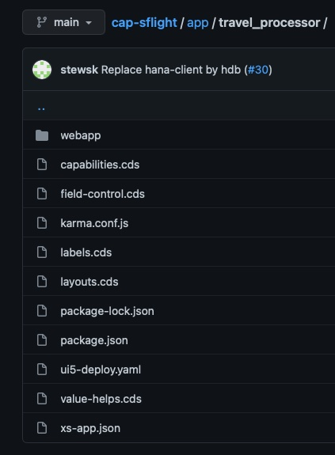
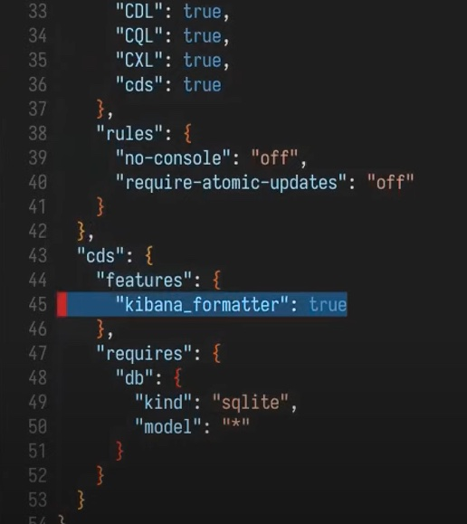

# cap-real-world
My findings from using CAP and Fiori Elements in real-world projects. Issues, workarounds and tips.

## Abbreviations used
| Abbreviation | Description |
| ------------ | ----------- |
| CAP          | Cloud Application Programming model |
| FE           | Fiori Elements |
| MTA          | Multi-target Archive |


# Contents
* [MTA's](#MTA)
    - [DefaultEnv CF CLI Plugin](#default-env-plugin)
* [CAP](#CAP)
    - [Scaffold a new CAP app](#scaffold-a-new-cap-app)
    - [How to setup the cds.requires section of package.json](#how-to-setup-the-cds-requires-section-of-package-json)
    - [Service Handlers](#service-handlers)
    - [Remote Services](#remote-services)
    - [Long running CAP service handlers](#long-running-cap-service-handlers)
    - [Efficient (dare I say best practice) annotation file structure](#efficient-dare-i-say-best-practice-annotation-file-structure)
    - [CodeLists](#codelists)
    - [Security - where to put role collections](#security-where-to-put-role-collections)
    - [Logging and Debugging](#logging-and-debugging)
    - [Kibana friendly log output](#kibana-friendly-logs)
* [FE](#fiori-elements)
    - [Value Helps](#value-helps)
    - [General](#fe-general)
    - [Managed Approuter specifics](#managed-approuter)
* [Node.js/NPM](#node-npm)
---

&nbsp;  
&nbsp;  

# MTA

### default-env plugin
The CF CLI default-env plugin is a great help in automatically creating your default-env.json file, which provides environment variables so that you can run services locally when developing.

Usage:
```
cf default-env adoptiontracker-srv
```
Where `myapp-srv` is the service instance on cloud foundry you want to pull down env vars from. So in this example I'm getting the env vars for a CAP service called myapp-srv.

NOTE: When you deploay an MTA, destinations seem to be overwritten and so when you try and execute your app locally again it won't find the destination on cloud foundry - requiring you to run `cf default-env myapp-srv` again...

```
resources:

#---------------------------------------------
# Destination to remote service
#---------------------------------------------
- name: remote-api-destination
  type: org.cloudfoundry.managed-service
  parameters:
    config:
      HTML5Runtime_enabled: true
      init_data:
        instance:
          destinations:
          - Authentication: NoAuthentication
            Name: remote-dest
            ProxyType: Internet
            Type: HTTP
            URL: https://blahblahblah/api/v1/search
          existing_destinations_policy: update
      version: 1.0.0
    service: destination
    service-plan: lite
```
Note the `existing_destinations_policy: update` value.
You could try changing this setting from `update` to `ignore` and indeed this stops the destination from being changed on each deployment. BUT - it seems the *bindings* are re-created every time anyway.
So, there does not seem to be a way to get around this (having to continually run default-enc) right now.

__You can of course minimise the need by only deploying the service that you have changed instead of the entire MTA each time.__


# CAP
## Scaffold a new CAP app
For a step-by-step procedure this is a great developer tutorial showing how to start a CAP project: [Build an application end-to-end using CAP, Node.js and VS Code](https://developers.sap.com/mission.btp-application-cap-e2e.html).

There are a lot of steps in this tutorial and its mostly boilerplate. We can use the [SAP HANA Academy CAP generator](https://github.com/saphanaacademy/generator-saphanaacademy-cap) to automatically create all this.

The SHA CAP generator is well explained in this [series of videos](https://www.youtube.com/playlist?list=PLkzo92owKnVwQ-0oT78691fqvHrYXd5oN) by the SHA team.

Some notes on the CAP generator:
&nbsp;
- Ideally you would use the HTML5 repository to host your web app. There is an option to put your web app inside the approuter, but its really only for small apps or test apps. If you choose the HTML5repo option then the generated sample fiori app will be correctly setup with UI5-tooling and the normal build process.
- This blog post: [How to share tables across different cap projects](https://blogs.sap.com/2021/10/03/how-to-share-tables-across-different-cap-projects/) is fantastic and each of these options is catered for by the CAP generator.
- This developer tutorial [Combine CAP with SAP HANA Cloud to Create Full-Stack Applications](https://developers.sap.com/mission.hana-cloud-cap.html) shows how to access native SAP HANA Cloud artefacts in a CAP project. The CAP generator also does this.

## How to setup the cds requires section of package json
See this example below. By using `profiles` we can run locally with mock users or a different database (sqlite db file) in "development mode". Then in "production mode" use the HANA Cloud db for example.

You can run the relevant profile like:
```
npx -p @sap/cds-dk cds build --production
```

The above is the CAP build step inside an mta.yaml file (as an example).

`cds watch` uses the `[development]` profile by default.

```
  "cds": {
    "requires": {
      "uaa": {
        "kind": "xsuaa"
      },
      "auth": {
        "[production]": {
          "strategy": "JWT"
        },
        "[development]": {
          "strategy": "mock",
          "users": {
            "joe": {
            },
            "julie": {
            },
            "bob": {
            }
          }
        }
      }
      ,
      "db": {
        "[production]": {
          "kind": "hana"
        },
        "[development]": {
          "kind": "sql"
        },
        "model": [
          "db",
          "srv"
        ]
      }
      }
    ,
    "hana": {
      "deploy-format": "hdbtable"
    }
  }

```

## Service Handlers
`each` has a special meaning in handler parameter names.
By naming the event or parameter in a handler `each` it will be called as a per-row handler - as a convenience shortcut.
```
this.after('each','Books', (book)=>{
  book.stock > 111 && book.discount='11%'
})
```

```
this.after('READ','Books', (each)=>{
  each.stock > 111 && each.discount='11%'
})
```

[Details](https://cap.cloud.sap/docs/node.js/services#event-handlers)

## Remote Services
tbd.

### Long running CAP service handlers
By default a CAP service destination will have a 30 second timeout. If you have a long running process then we can use the `HTML5.Timeout: 300000` (e.g. 5mins) parameter on the destination.
The destination needs to be the CAP service destination (the one which provides *srv-api*).

## Efficient (dare I say best practice) annotation file structure
I've always had an uneasy feeling with the metadata driven development model for fiori elements. We've always been taught about separation of concerns in software industry for decades now and here we are mixing up UI code with the persistence layer.

So what I try to do is still keep some separation. Where it makes sense I will add annotations to the data model but only annotations that matter at that level - things such as typecasts; units of measure and curreny annotations for example.

For all UI annotation I try best to keep them separated.

SAP provides a wonderful example repository for FE and CAP based on the Fligths data mode here: https://github.com/SAP-samples/cap-sflight.

In this sample app you can see that all the UI annotations are placed inside the `app` folder, which makes perfect sense to me.

But going forther, the annotation fles are split up into domains such that we have:
- `layouts.cds`
- `labels.cds`
- `value-helps.cds`

...and so on.

I find this separation awesome and its very quick to know where the annotations live for particular features. This becomes more and more important the bigger your app becomes. Lets face it - even an app with just two object pages can have a huge amount of UI annotations.

Here's a view of the directory structure:


## CodeLists
Make sure to only have one key field in a code list, otherwise FE won't be able to display the values properly. See examples here, particularly the last one which shows how to add additional fields (non key):
```
entity ActivityStatus : CodeList {
    key code : Integer enum {
            Planned    = 0;
            InProgress = 1;
            Cancelled  = 2;
            Complete   = 3;
        } default 0;
};

entity ActivityType : CodeList {
    key code : Integer enum {
            Renewal     = 0;
            Replacement = 1;
            Upsell      = 2;
            Go_live     = 3;
        };
    category : Integer;
}
```

__Note: If a field with a codelist attached is going to be used as an additional binding on a value help then there seems to be a bug that it cannot have 0's. So make your codelist 1-based if its and Integer key.__

## Security where to put role collections
Where is the best place to place your apps role collections and security info?
The SAP CAP tutorial says this:

"Further, you can add role collections using the xs-security.json file. Since role collections need to be unique in a subaccount like the xsappname, you can add it here and use the ${space} variable to make them unique like for the xsappname."

However, I prefer to place the role collections for my apps in the xs-security.json file instead of in the mta.yaml, even though you can use either. More complexity is allowed for in the xs-security.json file incuding attribute security.
Also - the best practice is to separate your development layers by sub-account and not space (dev, test, prod). This is the only way to truly keep things separated as a lot of BTP services don't have the concept of a cloud foudry space.

## Logging and Debugging
You may want to log debug information, but only when you are actually having issues - so not generally clogging up the logs.

A standard node.js way to do this is with the `debug` module.

Add it to the package.json as a dependency like so:
```
"dependencies": {
    "@sap/cds": "^4",
    "debug": "^4.3"
}
```

Now in the CAP service where you may like to issue debug logs (at the top of the file):
```
const debug = require('debug')('srv:catalog-service');

module.exports = ...
```

`srv:catalog-service` is any name you like and will be used to reference this module for when you want it to issue debug statements to the log (see further below).

Now, instead of doing calls to `console.log()` you can do calls to `debug()`.

e.g.
```
debug(ech.comments, {"country": each.country, "amount": each.amount});
```

When we run our app we need to set the `DEBUG` environment variable like so:
```
DEBUG=srv:* cds watch
```
This will set debug locally for this `cds watch` and it will do so only for modules matching this label `srv:*`. Remember that we imported the debug module with a name: `srv:catalog-service`.

When your app is deployed on cloud foundry we need to inject the debug environment into the service.

We can view cloud foundry app logs:
```
cf logs app-srv
```

Inject the environment variable
```
cf set-env app-srv DEBUG 'srv:*'
```
Restage the service for the environment variable to take affect
```
cf restage app-srv
```

[HANA Academy - Extension Generators - debug](https://www.youtube.com/watch?v=XA6S2zVpTSQ&list=PLkzo92owKnVwQ-0oT78691fqvHrYXd5oN&index=6)

## Kibana friendly logs
Configure the Kibana formatter in the package.json:


Use the kibana formatter like so:
```
const LOG = cds.log('custom')
LOG.info("My custom log output")
```


# Fiori Elements

## Value Helps
When creating value helps with dependent values on other fields I have noticed that they do not work when the dependent value is a `0`.

For example - this value help on ActivityType is dependent (or should be filtered) on the category, which is a separate field on the page:
```
annotate CustomersService.Activities with {
    activity_type @Common.ValueList: {
        CollectionPath : 'ActivityType',
        Label : 'Activity Type',
        Parameters : [
            {$Type: 'Common.ValueListParameterInOut', LocalDataProperty: activity_category_code, ValueListProperty: 'category'},
            {$Type: 'Common.ValueListParameterInOut', LocalDataProperty: activity_type_code, ValueListProperty: 'code'},
            {$Type: 'Common.ValueListParameterDisplayOnly', ValueListProperty: 'name'}
        ]
    };
}
```
If the category_code values can be 0, 1, 2, 3, 4 for example and 0 is chosen by the user, the filtering will not work!

__So your dependent values MUST NOT BE 0-based if they are Integers.__

## FE General
Please always lock your app to a specific version of SAPUI5. I have found that FE is notorious for breaking when new patch levels are released.

## Managed Approuter
When using the managed approuter be careful to set public: true in the sap.cloud node of the fiori apps manifest.json. Without this your app will not be available in the BTP cockpit under HTML5 apps and you won't be able to access it in the Launchpad service.

```
    "sap.cloud": {
        "service": "cappie-service",
        "public": true
    },
```
The public: true setting enables the app to be access by an approuter that is not in the same space (which I guess is the case when using the managed approuter).


# Node NPM
"Stay up to date, but don't break your productive app"
- Use package-lock.json
- Manually update dependencies regularly
```
npm outdated
npm update
```
